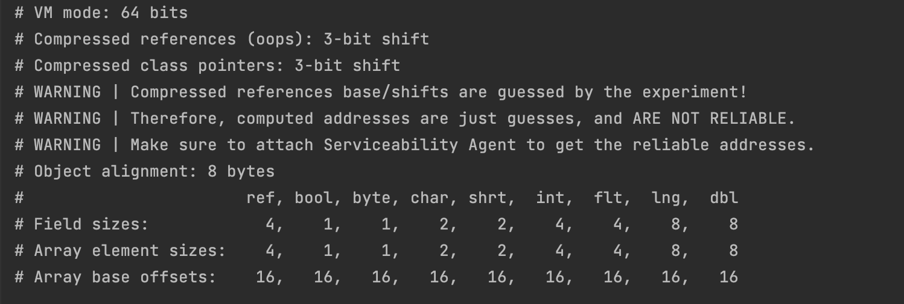
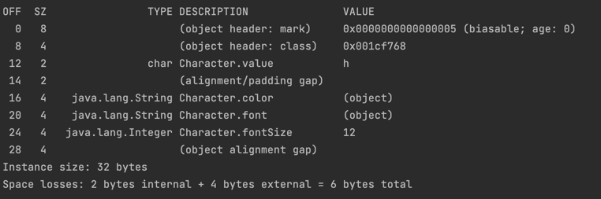
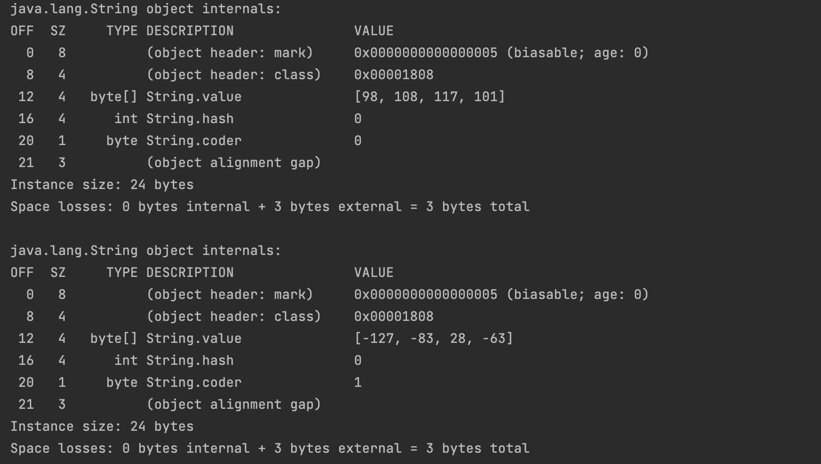

# FlyWeight 란?
## 경량 패턴의 정의, Intend
> 경량 패턴은 여러 객체가 공통으로 필요한 일부 상태, 일부 객체에 대해 각각에 모두 구현하기보단, 하나의 구현체를 공유하여 사용하는 패턴이다.

## 왜 필요한가? Pros
- 유사한 객체가 굉장히 많이 생성되어야 할때, 바뀌지 않고 공통으로 가져야할 고유한 상태들을 분리하여 하나의 객체를 공유하게하면 그만큼 메모리 사용을 절약할 수 있고, 성능 향상을 야기할 수 있다.

## 문제점은? Cons
- 경량 메서드를 호출하려 할때, 연산이 필요하다면 메모리사용을 줄이는 대신 CPU 연산을 늘리는셈이므로 Trade-Off를 고려해야한다.
- 코드가 복잡해진다. 경량패턴을 모른다면 코드를 왜 이렇게 짰는지 이해가지 않을 수 있다.

# 구현 코드

## 시나리오
> 폰트 타입, 색상, 폰트 크기 메타정보를 가진 글자를 렌더링한다고 가정해보자.  
> 만약 모든 글자 하나하나마다 메타정보를 각각 객체를 만들어가지고있다면 그 객체수만큼 메모리가 필요할 것이다.

## Before

### 글자 클래스

    public class Character {
        private final char value;
        private final String color;
        private final String font;
        private final Integer fontSize;
    
        public Character(char value, String color, String font, Integer fontSize) {
            this.value = value;
            this.color = color;
            this.font = font;
            this.fontSize = fontSize;
        }
    }

### Client
    public class Client {
    
        public static void main(String[] args) {
            new Character('h', new String("blue"), new String("궁서"), 12);
            new Character('e', new String("blue"), new String("궁서"), 12);
            new Character('l', new String("blue"), new String("궁서"), 12);
            new Character('l', new String("blue"), new String("궁서"), 12);
            new Character('o', new String("blue"), new String("궁서"), 12);
        }
    }

- 시나리오상 새로운 객체 생성을 하기 위해 String을 `new` 로 초기화하였다.

## 경량패턴이 유의미한 시나리오 가정

> 만약 위와같은 Character를 한 화면에 1000만자 동시에 렌더링해야하는 요구사항이 있다고 가정하자 

### 기본적인 `Character`객체 1000만개를 위해 필요한 메모리

자바 객체의 메모리사용량 분석 라이브러리로 위의 시나리오를 분석해보겠다.

`    testImplementation("org.openjdk.jol:jol-core:0.17")`

일단 jvm 벤더에 따라, 32비트 64비트인지에 따라 객체가 차지하는 메모리 크기는 다르다.

테스트해본 로컬 환경은 adoptJdk11 64bit jdk 이며, 객체는 실제 메모리 사용량과는 관계없이 8배수로 메모리 프레임을 차지한다.

이제 

            new Character('h', new String("blue"), new String("궁서"), 12);

위의 인스턴스를 측정해보면

해당 객체는 
- 12바이트의 패딩 
- char 'h' 2바이트 
- 객체 참조 4바이트(new 로 생성한 String"blue")
- 객체 참조 4바이트(new 로 생성한 String"궁서")
- Integer 참조 4바이트
총 26바이트며 패딩으로 6바이트가 더해져(8배수영하므로) 32바이트를 차지한다.
또한 참조하고있던 String 객체 두개는 각각

24바이트씩 차지한다.

int 래퍼인 Integer도 16바이트를 차지하므로 결국 위의 Character 객체 하나는 32 + 24 + 24 + 16 = 96바이트를 차지한다.

- Character 객체가 1000만개 생성되어야 하므로 `96byte * 1000만 = ` 약 900mb

즉 렌더링을 위해 순간적으로 1gb에 가까운 메모리를 필요로 하게된다.

> 실제로는 String은 리터럴로 취급하여 훨씬 낮은 메모리를 사용하게 되겠지만 단순 객체 생성 시나리오로서 작성했음을 다시 한번 언급한다.

## After

### 글자 클래스
    public class Character {
        private final char value;
        private final Font font;
    
        public Character(char value, Font font) {
            this.value = value;
            this.font = font;
        }
    }

### font

    public class Font {
        private final String font;
        private final String color;
        private final Integer size;
    
        public Font(String font, String color,Integer size) {
            this.font = font;
            this.color = color;
            this.size = size;
        }
    
        public String getFont() {
            return font;
        }
        
        public String getColor() {
            return color;
        }
    
        public Integer getSize() {
            return size;
        }
    }

### FlyWeightFactory(FontFactory)
    public class FontFactory {
        private final Map<String ,Font> cache;
    
        public FontFactory() {
            cache = new HashMap<>();
            cache.put("나눔", new Font("나눔","blue", 10));
            cache.put("굴림", new Font("굴림",,"blue", 10));
            cache.put("궁서", new Font("궁서",,"blue", 10));
        }
    
        public Font getFont(String font){
            return cache.get(font);
        }
    }    

### Client

        public static void main(String[] args) {
            FontFactory fontFactory = new FontFactory();
            Font goongsea = fontFactory.getFont("궁서");
            new Character('h', goongsea);
            new Character('e', goongsea);
            new Character('l', goongsea);
            new Character('l', goongsea);
            new Character('o', goongsea);
        }
    }

### 설명

flyWeight 패턴을 사용해 공통으로 사용할 `Font` 를 정의하고 해당 객체를 캐시하여 하나만 생성후 모든 객체가 공유하게 만들었다.

만약 위의 시나리오처럼 1000만개의 객체를 만드는 상황이라면 경량패턴을 사용할경우

`참조하는 String객체를 만들기 위해 필요한 메모리` 가 단 하나의 객체만으로 감축되므로 `약 900MB`의 메모리 사용을 감축시킬수 있다는 말이된다.

# 다른 패턴과의 관계
- Composite 패턴에서 여러 단말 객체들을 경량 패턴으로 구현해볼 수 있다.
- 경량패턴은 하나의 공통객체를 만든다는 측면에서 싱글톤 패턴과 유사하지만, 경량패턴은 공통 객체를 참조하는 여러 객체 생성을 상정한다는 점에서 차이가 있다.

# [학습예제 코드는 깃헙에](https://github.com/jinia91/DesignPattern/tree/main/src/flyweight)
# References
- [https://refactoring.guru/design-patterns/flyweight](https://refactoring.guru/design-patterns/flyweight)
- [백기선, 코드로 학습하는 GoF의 디자인 패턴](https://www.inflearn.com/course/%EB%94%94%EC%9E%90%EC%9D%B8-%ED%8C%A8%ED%84%B4/dashboard)
- [https://tangoblog.tistory.com/14](https://tangoblog.tistory.com/14)
