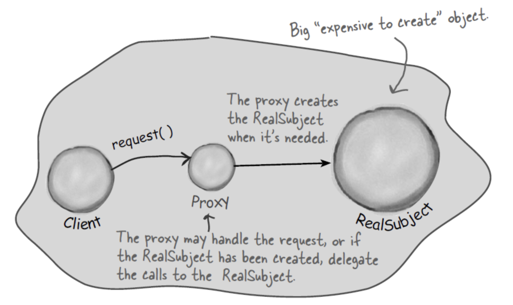

# Proxy 란?
## 프록시 패턴의 정의, Intend
> 프록시 패턴은 구조 패턴의 하나로, 특정 객체의 대체품 혹은 객체를 감싼 객체를 생성하고 원본 객체로의 접근을 제한하거나 객체에 요청하기 전후에 특정 로직을 수행하기 위해 사용되는 패턴이다.

### Intend에 따른 다양한 프록시 패턴
1. **지연 초기화와 virtual proxy**

   특정 객체가 매우 클때, 해당 객체를 앱이 시작될때 구동하는 것이 아닌, 호출되는 시점에서 초기화 하고 직전까지는 virtual proxy로 대체하는 방식
   고해상도 이미지를 렌더링하거나 해야하는 시점에서, virtual proxy를 통해 해당 이미지의 대체값(`alt`)를 보여주다가 렌더링이 완료되면 원본 객체의 접근을 허가하는 로직등을 생각해볼 수 있다.
Jpa에서 연관관계 매핑이 되어있는 다른 엔티티 참조또한 같은 패턴이다

   

2. **protect proxy**

   어떤 객체에 대한 접근을 특정 클라이언트에게만 허가하고 싶을 때, protect proxy를 통해 인증 처리를 할 수 있다.
4. **remote proxy**

   외부 서비스가 존재할때, 그 원격 객체에 대한 접근을 관리하고 로컬에서 대리해주는 패턴
   > 사실상 서버-클라이언트 패턴을 의미
   그외에도 로그를 찍기위한 loging proxy, 캐시를 위한 caching proxy 등도 패턴화시켜 생각해볼 수 있다.

## 왜 필요한가? Pros
- 실제 객체가 수행되기 전에 전처리나 캐싱등이 가능하며, 이때 실제 객체의 코드를 손댈필요가 없다(`OCP`)
- 클라이언트와는 상관없이 서비스객체의 흐름, 생명주기 제어가 가능해진다

## 문제점은? Cons
- 정적 프록시를 만든다면 클래스가 늘어나므로 애플리케이션 복잡도는 늘어난다.
- 프록시패턴은 그 자체로 오버헤드로 볼 수 있고, 서비스의 응답 지연을 낳는다.

# 구현 코드

> 로깅 찍기 수도코드를 통해 간단히 프록시 패턴을 구현해보자

## Before

    public class Service {
    
        public void doService(){
            System.out.println("do Service");
        }
    }

## V1

> 상속을 사용한 구현

### logging-proxy

    public class ServiceProxy extends Service {
    
        @Override
        public void doService() {
            System.out.println("---------------log start :");
            super.doService();
            System.out.println("---------------log finish");
        }
    }

### client
    public class Client {
    
        static private Service service = new ServiceProxy();
    
        public static void main(String[] args) {
            service.doService();
        }
    }

## V2
> 인터페이스를 통한 구현

### interface
    public interface ServiceInterface {
        void doService();
    }

### logging-proxy

    public class ServiceProxy implements ServiceInterface {
    
        private final ServiceInterface serviceOrigin;
    
        public ServiceProxy(ServiceInterface serviceOrigin) {
            this.serviceOrigin = serviceOrigin;
        }
    
        @Override
        public void doService() {
            System.out.println("---------------log start :");
            serviceOrigin.doService();
            System.out.println("---------------log finish");
        }
    }

### client
    public class Client {
    
        static private final ServiceInterface service = new ServiceProxy(new Service());
    
        public static void main(String[] args) {
            service.doService();
        }
    }

# 다른 패턴과의 관계
- 프록시 객체는 원본 객체와 동일한 인터페이스를 제공하지만, 어댑터는 다른 인터페이스를 제공한다는 점에서 차이점이 있다.
- 데코레이터 패턴은 프록시 패턴과 구조적으로(`composition을 사용한다는 측면에서 특히`) 매우 유사하거나 같지만
  프록시 객체는 원본 객체의 생명주기관리를 할 수 있는반면, 데코레이터 패턴은 클라이언트에 의해 합성이 제어된다는 차이를 갖는다.
- 원본 객체를 캡슐화하는 시각에서 퍼사드 패턴과 유사할 수 있으나, 프록시 패턴은 같은 인터페이스를 제공한다는 점에서 차이를 갖는다.

# [학습예제 코드는 깃헙에](https://github.com/jinia91/DesignPattern/tree/main/src/proxy)
# References
- [https://today-retrospect.tistory.com/102#02](https://today-retrospect.tistory.com/102#02)
- [백기선, 코드로 학습하는 GoF의 디자인 패턴](https://www.inflearn.com/course/%EB%94%94%EC%9E%90%EC%9D%B8-%ED%8C%A8%ED%84%B4/dashboard)
